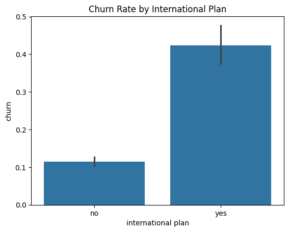
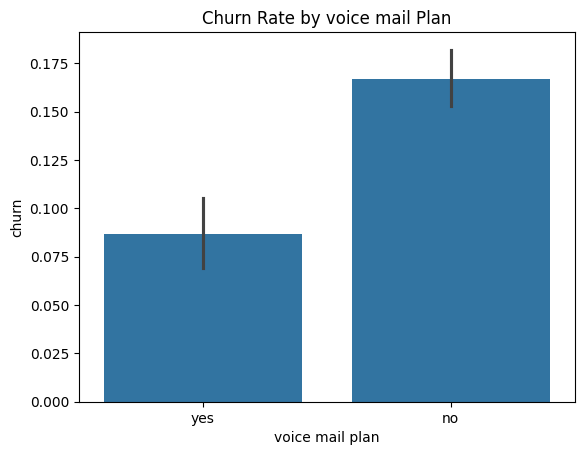
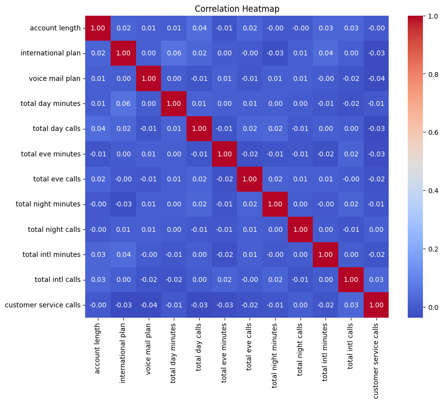
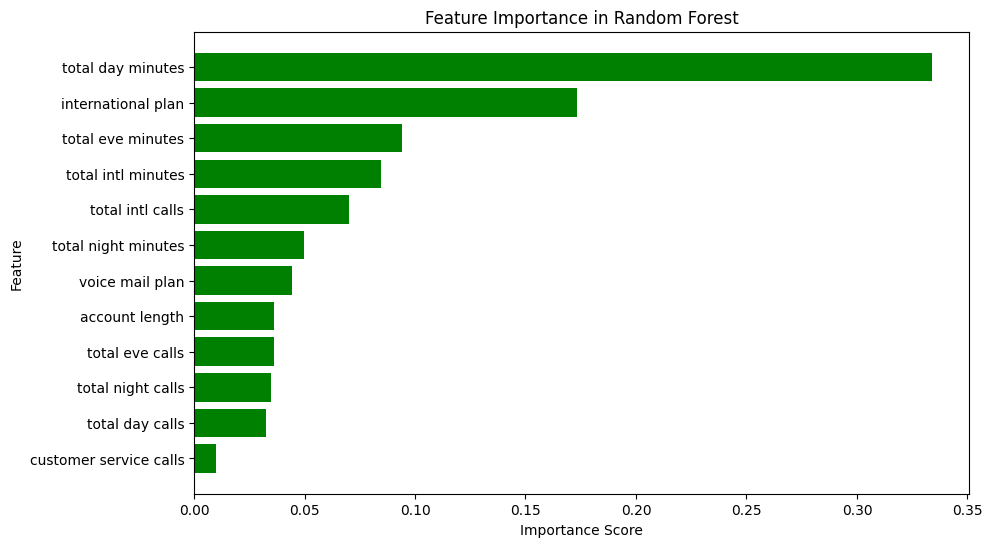

# Phase 3 Project: Customer Churn Prediction for SyriaTel

## Overview
This project develops a binary classification model to predict customer churn for SyriaTel, a telecommunications company. The model aims to:
- Identify customers likely to churn.
- Provide actionable insights into customer behavior.
- Enable targeted retention strategies to minimize revenue loss.

---

## Problem Definition
**Objective**: Create a machine learning model to predict customer churn (Yes/No).  
**Outcome**: Enable proactive interventions to mitigate churn risks and enhance customer retention.  
**Success Metric**: Evaluate models using metrics such as Accuracy, Precision, Recall, F1-Score, and AUC-ROC.

---

## Data Collection
- **Source**: [Kaggle Dataset](https://www.kaggle.com/datasets/becksddf/churn-in-telecoms-dataset)
- **Format**: CSV file containing customer demographics, account details, and usage patterns.

---

## Data Preparation
### Key Steps:
1. **Data Cleaning**:
   - Removed duplicate rows and irrelevant columns (`phone number`, `state`, `area code`).
   - Handled missing values (none found).

2. **Feature Engineering**:
   - Encoded categorical variables (`international plan`, `voice mail plan`).
   - Scaled numerical features using Min-Max Scaling.

3. **Outlier Handling**:
   - Detected outliers using boxplots.
   - Removed outliers using the IQR method.

### Visualizations:
- Boxplot of numerical features (Outliers detection).  
  

---

## Exploratory Data Analysis
### Key Insights:
- Churn rate differences based on `international plan` and `voice mail plan`.
- Correlation heatmap for feature selection.  

### Visualizations:
- Bar plots for churn rate by `international plan` and `voice mail plan`.  
  
  
- Correlation heatmap.  
  

---

## Modeling
### Models Used:
1. **Logistic Regression**
2. **Random Forest Classifier**
3. **Decision Tree Classifier**

### Model Evaluation Metrics:
- Classification Report (Precision, Recall, F1-Score).
- Confusion Matrix.
- ROC Curves and AUC Scores.

---

## Results
### Model Performance Summary:
| Model                 | Training Accuracy | Test Accuracy | AUC  |
|-----------------------|-------------------|---------------|------|
| Logistic Regression   | 89.32%           | 88.57%        | 0.861|
| Random Forest         | 100.00%          | 94.00%        | 0.871|
| Decision Tree         | 100.00%          | 90.86%        | 0.814|

### Visualizations:
- ROC Curves for all models.  
 

---

## Feature Importance
Analyzed feature importance using the Random Forest Classifier:
- `total day minutes`: Most significant feature.
- `international plan`: Significant predictor of churn.

### Visualization:
- Bar chart showing feature importances.  

---

## Conclusion
The **Random Forest Classifier** was identified as the best-performing model, with the highest AUC and test accuracy. Future improvements could focus on:
- Handling class imbalance using SMOTE or similar techniques.
- Further hyperparameter tuning to improve minority class prediction.

---
